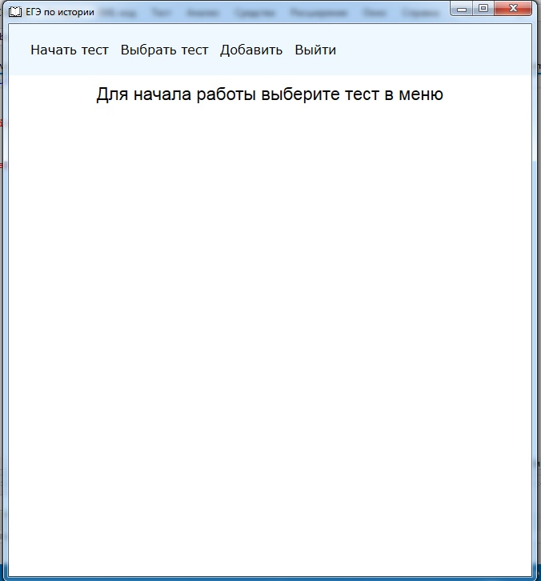
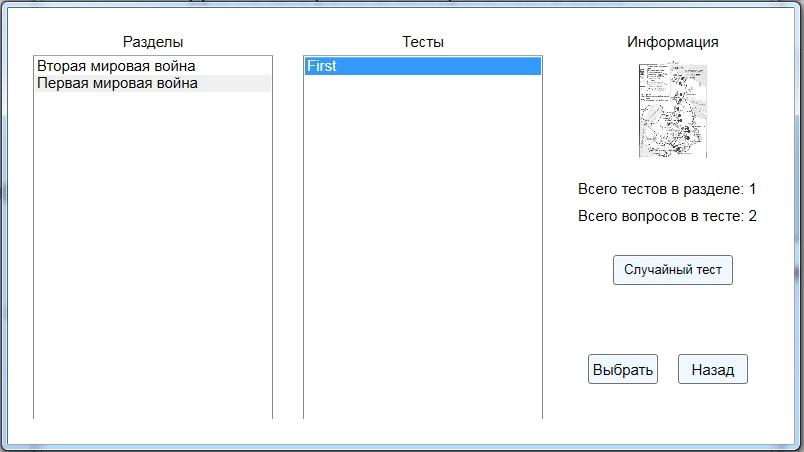
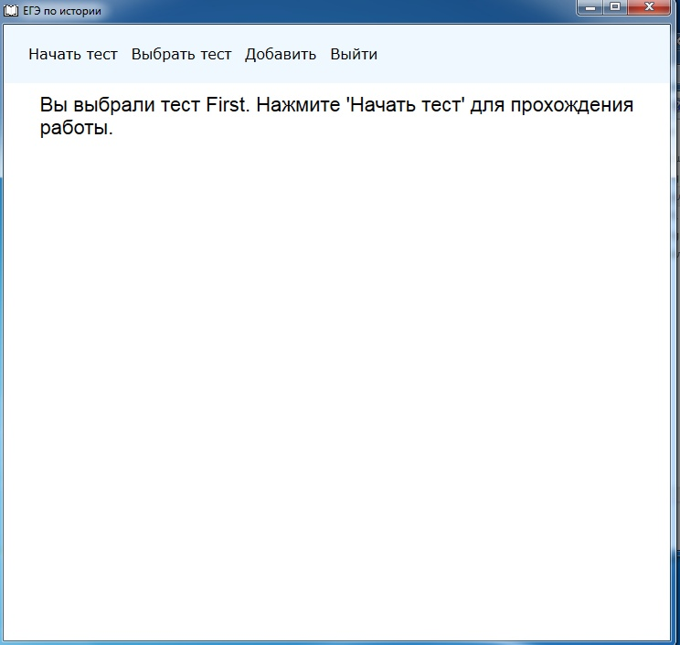
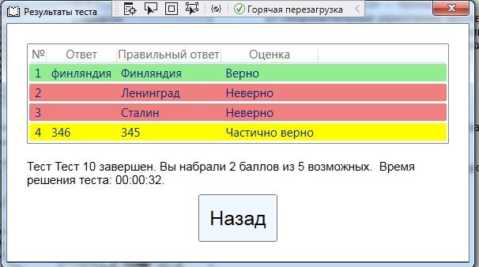
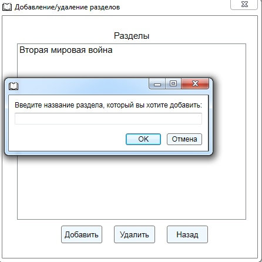
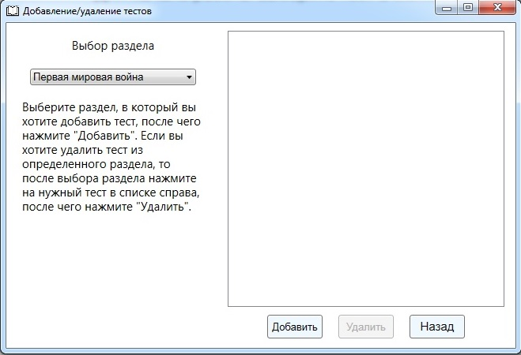
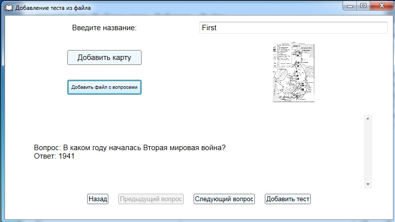

<h1 align="center">Тренажер ЕГЭ по истории</h1>

## описание

ЕГЭ по истории проводится достаточно давно, и некоторые задания, а в частности задания с картами, требуют более эффективной подготовки. Приложение, включающее в себя эти задания, очень поможет ученикам 10-11 классов в подготовке к экзамену.

## Как начать тест

1. На главной странице перейдите на вкладку «Выбрать тест».

##

2. На появившейся странице выберите нужный раздел, а затем нужный тест. С правой стороны Вы увидите информацию о выбранном тесте: предварительный просмотр карты, количество тестов в разделе, количество заданий в выбранном тесте, а также Вы можете выбрать случайный тест в выбранном разделе. После этого нажмите на кнопку «Выбрать».

##

3. Далее Вы вернетесь на главный экран, на котором вверху будет подсказка, что для запуска теста необходимо нажать кнопку «Начать тест».

##

4. После этого Вы перейдете на страницу Выполнения теста, где сможете начать его выполнение. Для перемещения между вопросами можно использовать кнопки «Следующий вопрос» и «Предыдущий вопрос». Ответы необходимо вводить в окне над кнопками, описанными выше. Ответы необходимо вводить без пробелов. Когда Вы будете готовы завершить текущую попытку, нажмите кнопку «Закончить тест».

##

5. После подтверждения завершения теста вам будут представлены результаты теста. Правильные ответы будут отмечены зеленым цветом, неправильные – красным, частично правильные (с одной ошибкой, если задание имеет множественный выбор) – желтым. Вы также увидите время, которое Вам потребовалось для прохождения теста.

##

## Как добавить раздел
1. На главном экране нажмите на кнопку "Добавить".
2. Вам будет предложено 2 варианта: "Раздел" и "Тест". Выберите "Раздел".
3. Откроется окно, спрашивающее у Вас пароль.
4. После введения верного пароля система уведомит Вас об этом и откроется окно Дабавления/Удаления разделов.
5. Для добавления разделов нажмите на кнопку "Добавить". Перед Вами окажется окно, спрашивающее название раздела.

6. После ввода названия в списке появится новый раздел.
7. Для удаления раздела достаточно выбрать нужный раздел и нажать кнопку "Удалить".
8. Для выхода нажмите кнопку "Назад".

## Как добавить тест
1. На главном экране нажмите на кнопку "Добавить".
2. Вам будет предложено 2 варианта: "Раздел" и "Тест". Выберите "Тест".
3. Откроется окно, спрашивающее у Вас пароль.
4. После введения верного пароля система уведомит Вас об этом и откроется окно Дабавления/Удаления тестов. Слева будет миниинструкция и кнопка с ползунком, справа будет список тестов выбранного раздела.

5. Для начала нужно слева нажать на кнопку с ползунком. Перед Вами окажется список разделов. Выберите нужный раздел.
6. Справа появится текущий список тестов данного раздела.
7. Для добавления нажмите кнопку "Добавить".
8. Перед Вами появится окно для задания названия теста, выбора изображения (карты) и выбора текстового документа с вопросами. При подгрузке изображения Вы сможете увидеть его предпоказ. Также в нижней части окна можно проверить правильность считывания вопросов/ответов.

9. Нажмите кнопку "Добавить тест", чтобы тест добавился в выбранный Вами раздел.
10. Для удаления теста достаточно выбрать нужный и нажать кнопку "Удалить".
11. Для выхода нажмите кнопку "Назад".
