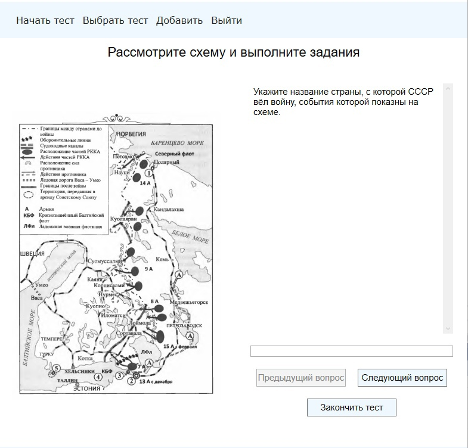

<h1 align="center">Simulator EGE in history</h1>

## Description

The Unified State Examination in history has been taking place for quite a long time, and some tasks, and in particular tasks with maps, require more effective preparation. An application that includes these tasks would greatly help students in grades 10-11 in preparing for the exam.

## How to start testing

1. On the main page, go to the "Выбрать тест" tab.

##

1. On the page that appears, select the desired section, and then the desired test. On the right side you will see information about the selected test: map preview, number of tests in the section, number of tasks in the selected test, and you can also select a random test in the selected section. After that, click on the “Выбрать” button.

##

1. Next, you will be returned to the main screen, on which there will be a hint at the top that to start the test you need to click the "Начать тест" button.

##

1. You will then be taken to the test execution page, where you can begin running the test. To move between questions, you can use the "Следующий вопрос" and "Предыдущий вопрос" buttons. Answers must be entered in the window above the buttons described above. Answers must be entered without spaces. When you are ready to complete the current attempt, click the "Закончить тест" button.

##

1. After confirming the completion of the test, you will be presented with the test results. Correct answers will be marked in green, incorrect ones will be red, and partially correct (with one error, if the task is multiple choice) yellow. You will also see the time it took you to complete the test.

##
